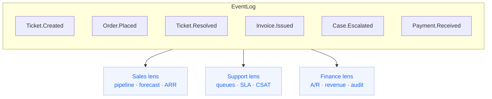
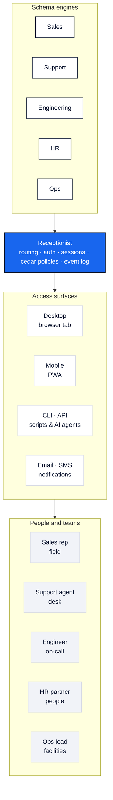
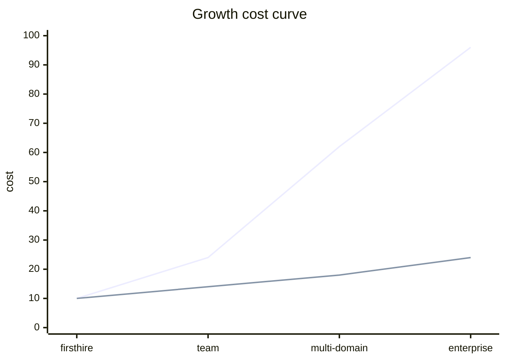
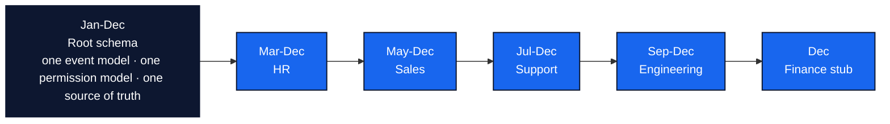

---
layout: hero
---

# univrs

Unfolding Nested Intent · Valid · Reliable · Safe

## Run the whole company for **less** than the cost of **one** Salesforce seat.

## Notes

- Open with the economic and organizational claim together.
- Frame this as company infrastructure, not an app pitch.
- The rest of the deck explains why this becomes necessary, not merely attractive.
- CEO: this is operating leverage.
- CFO: this is a cost-curve change, not a tooling swap.
- CIO and architecture: this is simplification of core primitives.
- Say it with ambition, not just thrift: we can unify how the company operates.

---

## Why do teams buy & use SaaS?

In short: Plan, agree, track, record & report activities from the viewpoint of their role.

### Why specific products?

- Familiarity, "Industry Standard"

---

---
layout: statement
---

## Not just CRM.

::boxes::
:fa-rectangle-ad: Campaigns
:fa-headset: Support Tickets
:fa-dev: Product & Eng Tracking
:fa-people-group: HR & Recruiting
:fa-truck-fast: Orders & Fulfilment
:fa-building: Facilities
::/boxes::

## Notes

- The problem is fragmented operations across the whole business.
- The ambition is one operating core for the company.
- CPO should hear that product and internal operations can share one semantic spine.
- CEO should hear that this is how execution scales coherently across functions.

---
layout: default
---

## An accumulating failure mode

- Every team buys their own tools. We have >1000.
- Every tool interprets identity & permissions differently.
- Every new workflow adds another translation layer.

## Notes

- This is the default fate of a growing company.
- Tool sprawl looks adaptive until it becomes structural drag.
- Every workflow adds translation, identity, and coordination cost.

---
layout: center
---

## This is not abundance

## It is **operational fragmentation**.

We are spending too much energy stitching together a company that should already know how it works.

## Notes

- Name the core disease: fragmentation, not lack of features.
- The company is paying to reconcile systems instead of run operations.
- This is a structural problem, not a vendor-specific one.
- Product framing: the company experience is fragmented because the underlying model is fragmented.

---
layout: center
content: wide
---

## Growth should make us sharper...

- Every new hire → bigger bill.
- Every new customer → bigger bill.
- Every new domain boundary → more license cost, more glue, more maintenance.

## Instead, growth makes the stack **noisier**, **slower**, more **error prone** _and_ more **expensive**.

## Notes

- Growth should improve leverage, but the SaaS stack makes growth more expensive.
- The cost model is hostile to scale because it rises with every operational dimension.
- This is why the problem is economic, not just technical.
- CFO: opex rises with headcount, customers, and domain count.
- CEO: the company becomes slower exactly when it should be compounding.
- Product framing: every new workflow should make the system smarter, not more fragmented.

---
layout: three-cols
---

## We keep paying to connect what should already be connected

::cols::

## **60–70%**

of IT budget goes to running and maintaining existing systems.

[Gartner / Deloitte ↗](https://www.solix.com/blog/how-legacy-systems-are-draining-your-it-budget-and-what-to-do-about-it/)

::col2::

## **1,000+**

SaaS apps in our stack today. Industry average is 80–400.

[Zylo, 2026 ↗](https://zylo.com/blog/saas-statistics)

::col3::

## **+15–20%**

integration spend growth, year over year — faster than overall IT.

[Integrate.io ↗](https://www.integrate.io/blog/data-integration-adoption-rates-enterprises/)

## Notes

- The exact figures are less important than the shape of the spend.
- Running old systems and integrating them is eating the budget.
- Glue is the hidden operating tax we are trying to remove.
- CIO: this is why the roadmap never gets cleaner on its own.
- Head of architecture: integration complexity is becoming the architecture.
- Product framing: too much effort goes into translation, not into better operating experiences.

---

## Audit today: a fire drill

### Exports

### Spreadsheets

### Archaeology

## Notes

- Keep this short and memorable.
- Audit work today is reconstructive because the systems were not built to preserve truth cleanly.
- That same weakness appears in compliance, reporting, and operations.

---
layout: three-cols
---

## Why this moment is different

##

## :fas-file:

### Rethink

The agentic era demands a complete overhaul of how records are kept.

::col2::

##

## :fa-database:

### Reshape

Enterprises need to not just **own** their data, but _control_ and _evolve_ the **shape** of it.

::col3::

##

## :fa-house-circle-check:

### Safeguard

Fine-grained permissions empower **humans** and **AI agents** to act, but do so safely and in the best interests of the company.

## Notes

- AI changes the requirement, not just the interface.
- Owning data is insufficient if the verbs and permissions are not owned too.
- This is why the argument is timely rather than academic.
- CPO: agents need product-safe verbs, not screen-level improvisation.
- CIO: AI without policy-native execution increases risk faster than it increases output.
- The next generation of software is not better dashboards; it is systems that can act safely.

---

## AI today is pretending the UI is the product

::arrows::

### Screen-scrape legacy systems.

### Hope the query selectors still match the HTML.

### Pray nothing leaks.

::/arrows::

## Notes

- Current AI automation is brittle and unsafe because it is UI-driven.
- Screen scraping is the wrong abstraction for enterprise action.
- This sets up the need for a typed execution surface.
- Product framing: the interface is not the system. The operating model is.

---
layout: default
---

## Oh, but we did API integration!

- Even if systems exchange _syntax_, we get "semantic drift"

- Does a Salesforce "OrderItem" == a JIRA "Component" == BuildKite "System"?

---

## univrs defines fields and rules for agents to act within.

```mermaid
flowchart LR
  classDef danger fill:#fff5f6,stroke:#ef223a,color:#0d1730,stroke-width:2px;
  classDef core fill:#1866ee,stroke:#0d1730,color:#ffffff,stroke-width:2px;
  classDef surface fill:#ffffff,stroke:#d9dce5,color:#0d1730,stroke-width:1.5px;
  classDef accent fill:#f1f5fe,stroke:#b9cdfb,color:#1866ee,stroke-width:1.5px;
  classDef muted fill:#f1f3f8,stroke:#d9dce5,color:#5f6880,stroke-dasharray: 4 4;

  subgraph Pixels[AI today · pixels]
    direction TB
    URL[crm-legacy.example.com/case/482?v=2]:::surface
    S1[div.x-1f9 → ???]:::muted
    S2[button.act-prim moved]:::muted
    S3[[role=textbox] stale ref]:::muted
    S4[modal confirm timeout]:::muted
    S5[table cell selector drift]:::muted
    FAIL[selectors break after release<br/>audit trail = screen recording]:::danger
    URL --> S1 --> S2 --> S3 --> S4 --> S5 --> FAIL
  end

  subgraph Verbs[univrs · verbs]
    direction TB
    V1[verb Resolve]:::core
    V2[actor = agent:triage-bot<br/>target = engineering.Ticket:7f3a<br/>transition = Resolve<br/>policy = AgentMayResolve]:::accent
    V3[Cedar checks<br/>event recorded<br/>replayable outcome]:::core
    V1 --> V2 --> V3
  end
```

## Notes

- Here is the needed interface for AI: verbs, policy, and recorded outcomes.
- This is the bridge from the problem to the architecture.
- Once you believe this, an owned operational core becomes necessary.
- CPO: this is how automation becomes product behavior rather than brittle scripting.
- Head of architecture: this is typed execution with replayable outcomes.
- CIO and CFO: safer automation reduces both incident risk and integration spend.
- This is the shift from automating clicks to expressing intent.

---
layout: center
---

## The credibility question:

> "Isn't this just a brittle custom build?"

## No

It is one schema, one event log, one permission model, and one execution surface.

## Notes

- Answer the obvious objection directly once the need is established.
- The point is simplification of primitives, not bespoke complexity.
- That is what makes the architecture durable.
- Head of architecture: the durability comes from fewer core abstractions.
- CIO: this is less stack sprawl, not more.

---
layout: center
---

## The company should remember what it does.

Everything is _first_ recorded as an event.

No lock-step sync jobs. No "which copy is right?"

Current state is a _projection_ in memory, with regular snapshots.

Even **schema evolution** _itself_ is events.

## Notes

- Start showing why this core works.
- Facts are recorded first; views are derived afterward.
- That removes the synchronization problem at the root.
- Product framing: memory is a feature. The system should learn, explain, and replay.

---

## Every team sees the same company through a different lens



Same data, different lenses. No sync jobs. No translation layers.

## Notes

- Integration becomes projection over one log rather than synchronization between systems.
- This is how the company gets many views without many copies.
- It is a simpler and cheaper integration model.
- Product framing: one operating core, many purpose-built experiences.

---
layout: center
---

## Trust is a built-in behavior.

Every action gates through a [**Cedar policy**](https://cedar.dev) _before_ it runs.

## Notes

- Compliance should be runtime behavior, not cleanup work.
- Policy enforcement before action is the key move.
- This lowers executive risk while lowering operational effort.
- CFO and CEO: lower risk is a financial outcome, not just a control outcome.
- CIO: auditability is built in instead of bolted on.
- Product framing: safety should be native to the product, not external to it.

---
layout: two-cols
---

## Every event answers four questions

```kdl
event "Executed" {
    at             "2026-05-05T14:23:01.847Z"
    actor          "user:njr"
    target         "engineering.Ticket:7f3a-critbug"
    transition     Transition::Resolve
    from_state     Status::Pending_Resolution
    to_state       Status::Resolved
    policy         "ManagerSignoff"
    correlation_id "saga:9c1e-2f04"
}
```

::right::

- What changed, and when?
- Who changed it?
- **Which policy allowed it?**
- What was the workflow state at that microsecond?

Lower IT cost. Lower executive risk.

## Notes

- This is the executive-grade audit atom.
- Every meaningful action carries identity, policy, and state context with it.
- The payoff is both stronger accountability and lower cost.

---



## Notes

- This is the owned operational core the company actually needs.
- Domain engines sit on one receptionist, one policy surface, and one event log.
- Once this exists, every interface becomes a projection or a channel around the same truth.

---
layout: three-cols
---

## univrs runs a schema. **KDL** is the schema

::cols::

### domain

```kdl
domain engineering {
  prefix ENG

  component Ticket {
    field title    string required
    field owner    @Email
    field site     @Address
    field priority string {
      enum "Low" "Medium" "High"
    }
    field estimate int

    check estimate {
      case "value > 40" warn
    }
  }
}
```

::col2::

### workflow

```kdl
workflow Resolve
  component=engineering.Ticket {

  state Open
  state InProgress
  state Resolved

  transition Resolve
    from=InProgress
    to=Resolved
    verb=Execute
}
```

::col3::

### screen

```kdl
screen "Ticket Detail"
  component=engineering.Ticket
  kind=form {

  section "Overview" {
    field title
    field owner
  }
  section "Details" {
    field priority
    field estimate
    field site
  }
}
```

## Notes

- KDL is the control surface for the core.
- Domain, workflow, and screen stay in one legible system.
- The purpose is coherence and auditability, not novelty of syntax.

---
layout: three-cols
---

## How records compose. **ECS**, not class trees

**E**ntity **C**omponent **S**ystem: data structure used in massive online games with hard real-time constraints.

::cols::

### Class hierarchy

```ts
class Asset {
  id: string
}
class Room
  extends Asset {
  building: string
  capacity: number
}
class MeetingRoom
  extends Room {
  av_kit: string[]
}
```

Behavior is _locked into the type_. Marking a room **OutOfService** means a subclass, a flag column, or a code change everywhere `Room` is used.

::col2::

### Tables + joins

```sql
SELECT r.id, b.name,
       o.headcount,
       m.next_due
FROM   rooms r
JOIN   buildings b
  ON b.id = r.building_id
JOIN   occupancy o
  ON o.room = r.id
JOIN   maintenance m
  ON m.room = r.id;
```

Every query _reassembles_ the room from foreign keys. Adding **OutOfService** means a new table _and_ a new join everywhere it appears.

::col3::

### ECS components

```kdl
entity Room#HQ-A14 {
  Location     { bldg HQ; floor 3 }
  Occupancy    { cap 12 }
  OutOfService { until "2026-05-12" }
}

entity Printer#3F-04 {
  OutOfService { until "2026-05-10" }
}

entity Factory#KCMO {
  OutOfService { until "2026-06-01" }
}
```

Entity is just an _id_. **OutOfService** is one row of data — and the _same_ component attaches to a Room, a Printer, or an entire Factory. No subclass, no extra table, no per-type code path.

## Notes

- This shows how the model stays extensible without becoming tangled.
- Operational concepts compose across domains instead of being rewritten.
- That matters if the system is meant to run the whole company.

---
layout: center
---

## We should own the logic

## Not the box.

SaaS rents us somebody else's workflow. univrs turns our operating model into a **capital asset**.

## Notes

- Now make the strategic jump explicit.
- We do not just need cheaper software; we need owned operating logic.
- That is why the answer is to build the core.
- CEO: this is the strategic asset.
- CPO: product and operations logic stop drifting apart.
- CFO: money spent here compounds instead of renewing forever.
- This is the heart of the pitch: our operating model should become ours.

---
layout: statement
---

## _Modest_ hardware.

## _Extreme_ scale.

- Memory-protected
- Event-sourced
- Shared-nothing
- Sharded

The whole company runs on infrastructure cheaper than **one SFDC seat** (~$5K/year).

## Notes

- Reinforce that this is not a giant infrastructure gamble.
- The economics improve because the architecture is compact and scalable.
- This makes building the core financially plausible.

---

## univrs changes what growth feels like



A new domain — Logistics, Facilities, Ops — is a **schema promotion**, not a new app project.

## Notes

- This is the economic payoff of the architecture.
- New domains extend the model instead of spawning new systems.
- That is why building the core changes the cost curve.
- CIO: the roadmap becomes additive instead of multiplicative.
- CFO: new capability stops implying a new vendor category.
- Head of architecture: extension happens within one model, not across more seams.
- Product framing: each new domain should make the product stronger, not messier.

---

## Start with one spine. Let the company unfold from it



Each new domain is a **schema** promotion, not another integration program.

## Notes

- This makes the rollout path concrete.
- The company does not need to replace everything at once.
- One root spine can expand domain by domain over time.
- CEO and CFO: this is phased execution, not a big-bang rewrite.
- CIO: the migration story is controlled and sequential.
- Product framing: this is a roadmap that compounds.

---
layout: hero
---

## Once the core exists, every channel can feel like the same company

```mermaid
flowchart LR
  classDef core fill:#1866ee,stroke:#0d1730,color:#ffffff,stroke-width:2px;
  classDef channel fill:#ffffff,stroke:#d9dce5,color:#0d1730,stroke-width:1.5px;
  classDef edge fill:#fff5f6,stroke:#ef223a,color:#0d1730,stroke-width:2px;
  classDef accent fill:#f1f5fe,stroke:#b9cdfb,color:#1866ee,stroke-width:1.5px;

      c1[SMS · MMS<br/>notifications · replies]:::channel
      c2[Voice<br/>IVR · call routing]:::channel
      c3[WhatsApp<br/>customer messaging]:::channel

    Core[univrs core<br/>schema engines · receptionist · event log · cedar policies<br/>system of record · workflow engine · permissions · replay]:::core

      s1[Email<br/>SendGrid delivery]:::channel
      s2[Verify · Lookup<br/>identity · number trust]:::accent
      s3[Conversations · Flex<br/>omnichannel service edge]:::edge
  end

  c1 --> Core
  c2 --> Core
  c3 --> Core

  Core --> s1
  Core --> s2
  Core --> s3
```

Twilio does not replace the core. It gives the core reach: messaging, voice, email, identity, and contact-center surfaces that all express the same operating model.

## Notes

- This is the culmination, not the premise.
- First build the owned operational core; then connect it to the world through Twilio.
- Twilio is the communications edge, while univrs remains the system of record, workflow engine, and policy surface.
- CEO: this is how the company reaches customers without renting the operating model.
- CPO: channels become expressions of the core, not separate products.
- CIO and architecture: Twilio lives at the edge, not in the center of the truth model.
- Product framing: every touchpoint should feel like one company because it is powered by one core.

---
layout: two-cols
---

## Why build it now

- Lower structural spend
- Faster process changes
- Company-wide semantic spine

::right::

## Why it can scale safely

- One permission model
- Durable audit and replay
- Far less integration surface

## Notes

- This slide is the decision frame.
- Left side: why this expands what the company can become.
- Right side: why we can trust it as it grows.
- This is not only an efficiency move. It is a coherence move.
- Technical teams should hear that the leverage comes from one model with fewer seams.

---
layout: center
---

## The strategic asset is not the UI.

It is the operating model underneath it: one system that can finally describe, guide, and improve how the company actually works.

## Notes

- Slow down here.
- This is the emotional center of the deck.
- We are not proposing another interface layer.
- We are proposing that the company finally own the logic of how it works.
- Once that is true, better products, better automation, and better execution all follow.

---
layout: statement
---

## Build the core once.

## Let every team, agent, and channel run from the same truth.

Why are we still funding translation layers?

## Notes

- End with conviction, not defensiveness.
- The deck has shown that building the core is both necessary and affordable.
- The ask is simple: stop funding fragmentation and start funding the core.
- For a technical company, this is the highest-leverage product we can build.
- End on possibility: one company, one model, many experiences.

---
layout: statement
---

## Appendix:

## Why this stack exists.

Each choice optimizes for durability, auditability, and cost.

## Notes

- Signal that the appendix is about why the stack choices are intentional.
- None of these picks are for fashion; they are in service of operating economics.
- If time is short, this section can be skimmed or skipped.

---
layout: two-cols
---

## Runtime + UI

### Our choices

- **Rust** - predictable latency, compact footprint, memory safety.
- **Axum** - small, explicit HTTP layer; easy to keep the surface narrow.
- **Maud** - HTML stays typed, server-owned, and reviewable.
- **Datastar** - reactive UX without a client app framework tax.
- **Server-exclusive state** - one source of truth; no client/server divergence.

::right::

### What we avoid

- **No React** - less duplicated state, hydration, bundling, and app-shell complexity.
- **No Tailwind** - fewer ad hoc design decisions embedded in markup.
- **No REST or GraphQL** - the system exposes verbs over one domain model, not data plumbing APIs.
- **No thick SPA** - faster cold start, easier authz, simpler debugging.

## Notes

- The runtime and UI choices are about keeping the surface narrow and understandable.
- Server ownership reduces duplicated state and accidental complexity.
- We are optimizing for long-term operability, not trend alignment.

---
layout: two-cols
---

## Schema + behavior

### Our choices

- **KDL** - business logic stays declarative, diffable, and authorable.
- **CEL for validation** - rich constraints close to the schema, not buried in handlers.
- **Cedar permissions** - policy is explicit, testable, explainable, and replayable.
- **Declarative metrics** - reporting logic is versioned with the business model.

::right::

### What we avoid

- We do not want forms, rules, policy, and reporting scattered across five stacks.
- We want a new domain to be a schema promotion, not a new app project.
- We want every decision to survive replay and audit.

## Notes

- Schema and behavior belong close together so the system stays legible.
- Mainstream defaults scatter core business logic across too many layers.
- We want domain promotion to be declarative, not a bespoke engineering project.

---
layout: two-cols
---

## Persistence + execution

### Our choices

- **Event sourcing** - complete history, deterministic replay, cheap audit.
- **Crypto shredding** - delete sensitive meaning without corrupting the historical ledger.
- **Metric backfill** - new questions can be answered from old facts.
- **rkyv** - zero-copy hot state handover and dense in-memory snapshots.

::right::

### What we avoid

- Compliance stops being an export exercise.
- Analytics does not depend on whether someone modeled the report up front.
- Schema evolution can be fast without losing operational continuity.

## Notes

- Persistence choices are downstream of the auditability goal.
- Event history should remain intact even as privacy and schema requirements evolve.
- This is what lets the system answer new questions from old facts.

---
layout: two-cols
---

## Search + read model

### Our choices

- **Tantivy** - local, embeddable full-text search with strong performance.
- **Shared-nothing + sharded design** - scale-out economics without SaaS-seat pricing.
- **Single event log** - integration becomes projection, not synchronization.

::right::

### What we avoid

- We prefer one internal truth over many service-specific copies.
- We prefer embedded infrastructure where it keeps cost and latency down.
- We prefer generated read models over hand-built integration glue.

## Notes

- Search and read models should be embedded where that improves cost and latency.
- The shared-nothing shape supports scale without SaaS pricing dynamics.
- Again, the theme is one truth with many projections.

---
layout: center
---

## The pattern is deliberate.

Fewer layers. Fewer copies. Fewer translations.

More history. More leverage. More control.

## Notes

- Summarize the architecture pattern in plain business terms.
- Fewer layers and copies reduce cost; more history increases control.
- This is a deliberate trade toward operating leverage.

---
layout: statement
---

## The architecture is opinionated

## because the economics are.

The mainstream stack optimizes for shipping apps. univrs optimizes for running the whole company.

## Notes

- Close by restating the thesis at the architecture level.
- App stacks optimize for local product delivery; this stack optimizes for enterprise operation.
- The economics force the opinionated design.
